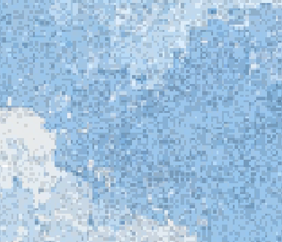
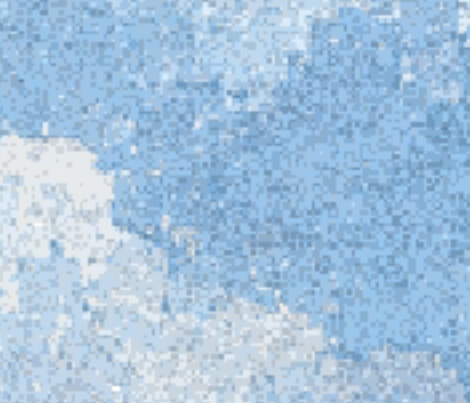

# 大屏颗粒校正 · 2026-10-04

用户报告预览与手机满意，大屏颗粒变粗且不均匀。已读取本轮两张参考截图，问题对应原采样规则 `ceil(innerWidth / 960)`：超过 960、1920、2880 时采样块分别变成 2、3、4 CSS 像素。组件布局、内容、字体、玻璃和素材不在修改范围。

修正云层采样：屏幕采样步长固定 1 CSS 像素，覆盖宽度随视口连续变化；宽屏放大时采用细分颜色采样，避免重复整块源像素。窄屏保持原来的最近邻采样。Canvas 与 WebGL 使用同一尺寸逻辑，滚动仍按整数采样步长定位。没有增加素材体积、生成新云图、增加整张大图缓存或触摸屏动效。共享阅读页的云层也随相同模块更新。

测试先失败（所有宽度固定 1 像素的断言），再修复通过。`scripts/qa/paper-grain-scale.cjs` 以同一浏览器记录旧版后，对比 390、960、961、1440、1920、1921、2560、3840，分别检查 Canvas 与强制 WebGL。Canvas 测试 DPR 为 3，WebGL 为 1.25；二者是自动化模拟，不是显示器物理校准。

16 个场景没有横向溢出或脚本异常；两种后端的 390 宽度云层画面签名与旧版分别一致。2560 大屏局部，相邻像素完全同色的比例从 78.0% 降为 28.4%，证明减少了源像素整块复制，不只是改变统计字段。截图为实际云层画布的 1:1 局部，未调整颜色或模糊；由于覆盖尺寸改为连续适配，云的取景也会随宽度变化。

| 修改前 | 修改后 |
|---|---|
|  |  |

检查记录：`grain-scale-before-results.json`、`grain-scale-after-results.json`、`grain-scale-pixel-evidence.json`。构建 34 页，静态检查 0 错误、0 警告、2 个原有提示；五种兼容模拟，以及云层穿梭、鼠标与点击粒子、3D 和阅读交互检查通过。

浏览器缩放与系统显示缩放仍会影响实际物理像素与观感；本轮保证逻辑采样细度，不宣称不同屏幕的真实颗粒尺寸完全相同。手机画面一致结论来自同一浏览器的修改前后对照。
